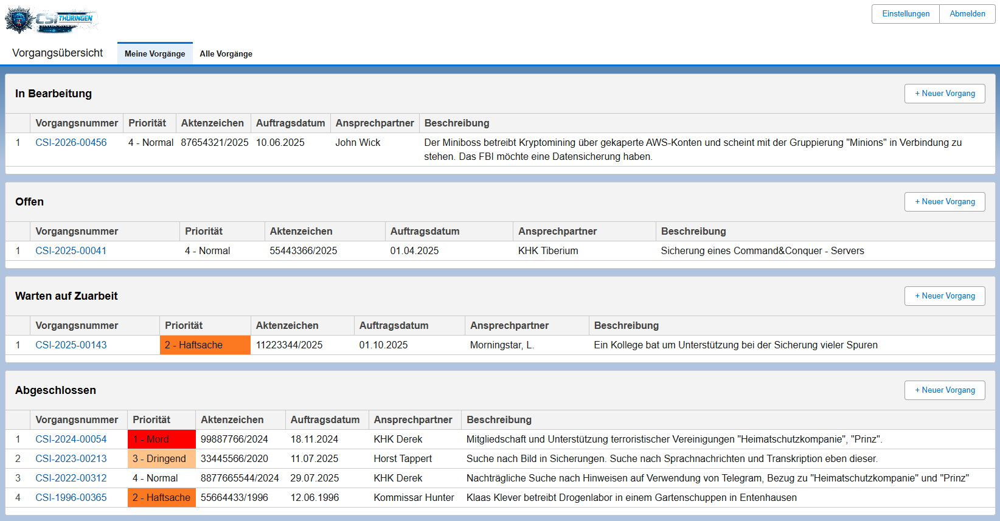
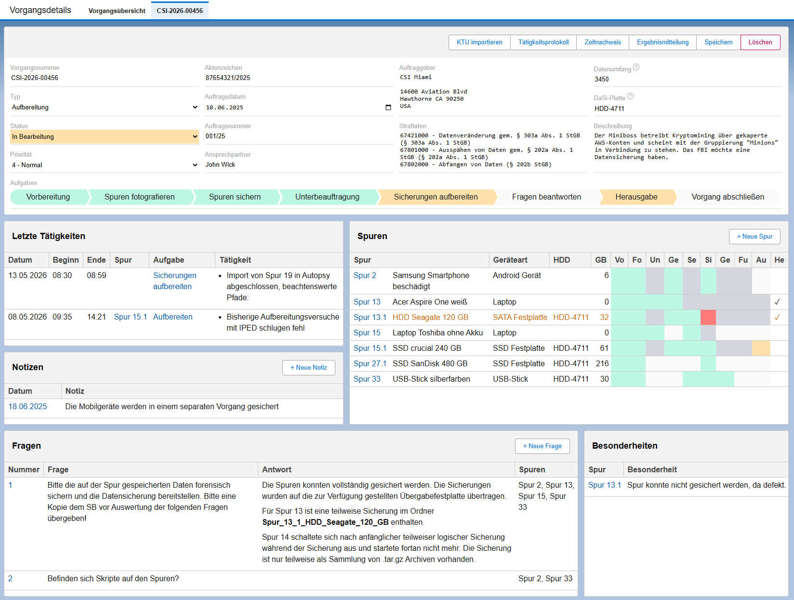
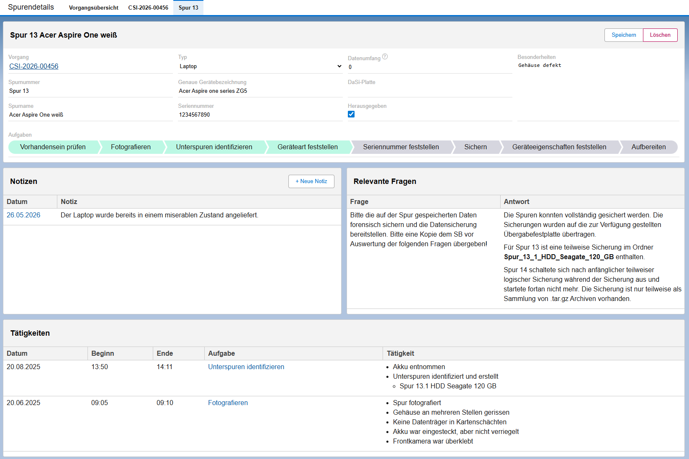
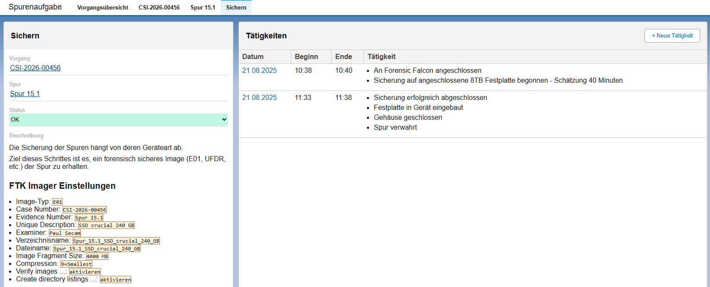
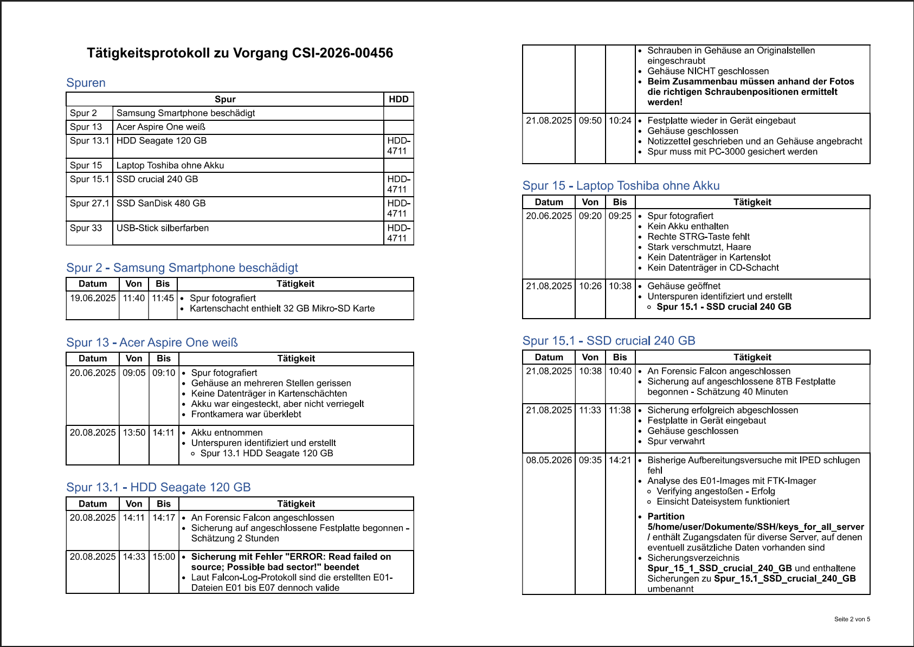
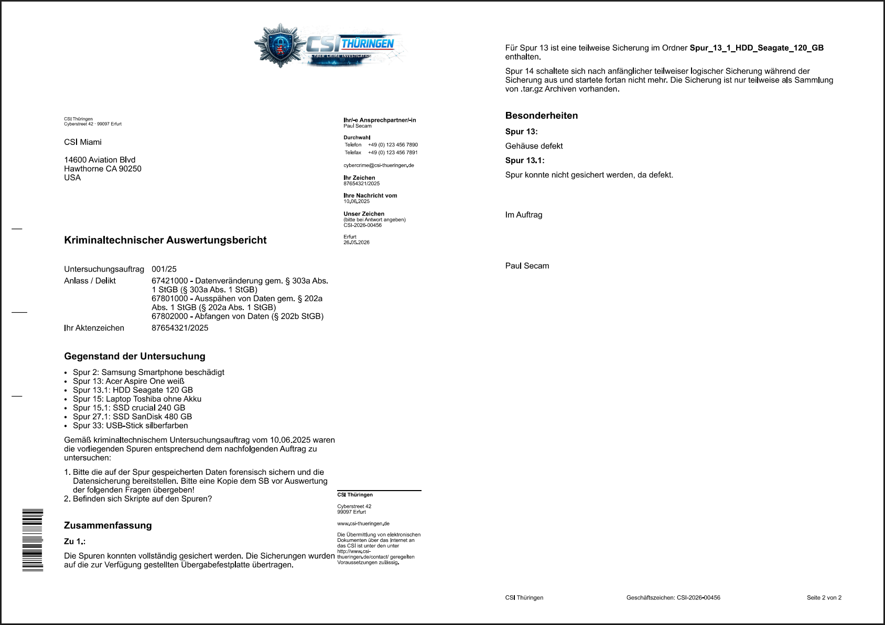
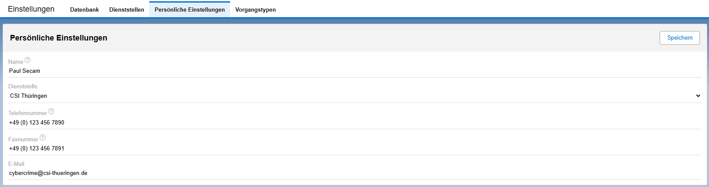
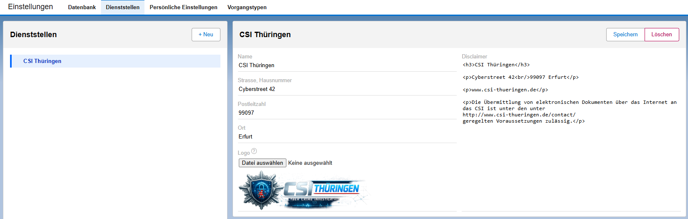
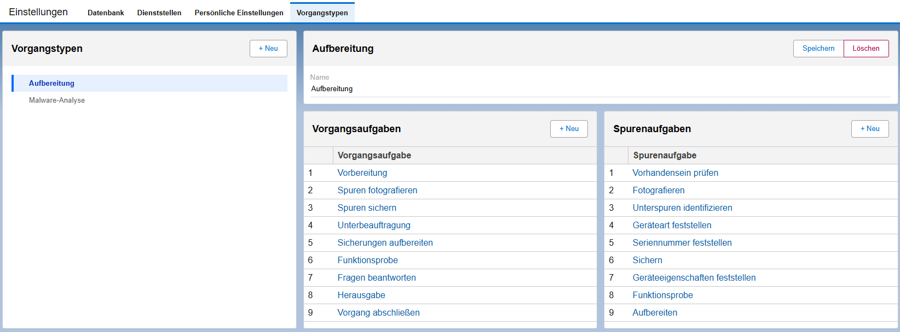
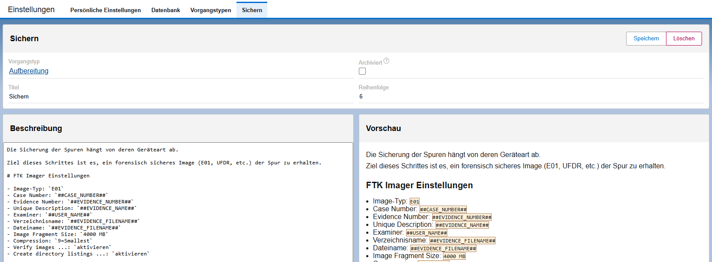

# forensics

Forensics ist ein Programm zu Protokollierung von Tätigkeiten im Bereich der digitalen Forensik. 
Hiermit lassen sich Vorgänge und Spuren sowie deren Zustände verwalten und Aktivitäten dokumentieren.
Ferner können forensische Prozesse definiert und beschrieben werden, welche bei der Vorgangsbearbeitung als Hilfestellung angezeigt werden.
Als Ergebnis können Tätigkeitsberichte und offizielle Ergebnismitteilungen generiert und heruntergeladen werden.

## Vorgangsübersicht

In der Vorgangsübersicht werden alle Vorgänge - nach Zustand sortiert - angezeigt



## Vorgangsdetails

Diese Ansicht zeigt die detaillierten Informationen zu einem Vorgang. Zusätzlich werden die Spuren, Notizen, Fragen und Besonderheiten des Vorgangs als Überblick dargestellt sowie die neuesten Tätigkeiten.



## Spurendetails

Die Spurendetails enthalten alle wichtigen Informationen zu einer Spur.



## Aufgabendetails

In den Aufgabendetails bekommt der Benutzer eine genaue Anleitung der jeweiligen Aufgabe eingeblendet und kann jede einzelne Tätigkeit zu der Aufgabe genau protokollieren.



## Tätigkeitsprotokoll

Das Tätigkeitsprotokoll, welches über die Vorgangsdetails erreichbar ist, kann jederzeit generiert werden und enthält eine chronologische Auflistung aller bisher durchgeführten Tätigkeiten zum Vorgang und dessen Spuren.



## Ergebnismitteilung

Die Ergebnismitteilung kann über die Vorgangsdetails generiert werden. Sie ist ein Dokument mit vordefiniertem Aufbau und dient als zusammenfassender Bericht zur Vorgangsabarbeitung.
In der Ergebnismitteilung werden die grundlegenden Informationen zu einem Vorgang sowie die dazu gestellten Fragen und die entsprechenden Antworten aufgeführt.



## Persönliche Einstellungen

Die persönlichen Einstellungen sind über den Button **Einstellungen** zu erreichen.
Hier kann der Benutzer Informationen über sich selbst bereitstellen, die anschließend im Tätigkeitprotokoll und in der Ergebnismitteilung ausgegeben werden.



## Dienststellen

Jeder Benutzer gehört einer Dienststelle an.
Auf dieser Seite werden spezifische Angaben zur Dienststelle gemacht, die in der Ergebnismitteilung angewandt werden.



## Vorgangstypen

Auf dieser Seite können verschiedene Typen von Vorgängen definiert werden, die unterschiedliche Vorgehensweisen erfordern.



Davon abhängig können im Anschluss spezifische Aufgaben definiert werden, die für den Vorgang selbst oder für einzelne Spuren des Vorgangs auszuführen sind.
Dabei kann eine detaillierte Aufgabenbeschreibung formuliert werden, über die die Benutzer genau wissen, was in welchem Schritt zu tun ist.



## Platzhalter

In den Textfeldern der Einstellungen (Dienststellen, Aufgabendefinitionen, etc.) können verschiedene Platzhalter verwendet werden. Diese werden anschließend in den Aufgabenbeschreibungen oder in den generierten Dokumenten mit den jeweiligen konkreten Inhalten ersetzt.

Auf diese Art können beispielsweise Aufgabenbeschreibungen sehr spezifische Informationen zu einzelnen Spuren enthalten - beispielsweise vordefinierte Kommandozeilen under Dateiinhalte.

|Platzhalter|Bedeutung|
|-|-|
|`##CASE_DATASIZE##`|Datenumfang des gesamten Vorgangs.|
|`##CASE_DIRNAME##`|Verzeichnisname für Vorgang. Besteht aus der Vorgangsnummer, wobei Sonderzeichen durch Unterstriche ersetzt werden.|
|`##CASE_ID##`|Id des Vorgangs.|
|`##CASE_NUMBER##`|Vorgangsnummer.|
|`##CASE_REFERENCEDIRNAME##`|Verzeichnisname für Aktenzeichen des Vorgangs. Auch hier werden Sonderzeichen durch Unterstriche ersetzt.|
|`##IPED_BATCH_FILE_CONTENT##`|Inhalt einer generierten Batch-Datei, welche aus allen Spuren des Vorgangs ein zusammenfassendes IPED-Projekt generiert.|
|`##MD_IMAGE_DIR##`|Kommandozeilenbefehl zur automatisierten Erstellung von Bildverzeichnissen für alle Spuren eines Vorgangs.|
|`##VORGANG_AUFTRAGSDATUM##`|Auftragsdatum des Vorgangs.|
|||
|`##EVIDENCE_FILENAME##`|Dateiname für eine Spur, bestehend aus Spurnummer und Spurname. Sonderzeichen werden durch Unterstriche ersetzt.|
|`##EVIDENCE_NAME##`|Name einer Spur.|
|`##EVIDENCE_NUMBER##`|Spurnummer.|
|`##EVIDENCE_SHORTFILENAME##`|Kurzer Sateiname für eine Spur, bestehend aus der Spurnummer. Sonderzeichen werden durch Unterstriche ersetzt.|
|`##IPED_EVIDENCE_BATCH_FILE_CONTENT##`|Inhalt einer Batch-Datei, welche für eine einzelne Spur ein IPED-Projekt erstellt.|
|||
|`##USER_NAME##`|Selbst vergebener Name des aktuellen Benutzers aus den persönlichen Einstellungen.|
|`##ACTIVITYLOG_FILENAME##`|Dateiname für das Tätigkeitsprotokoll. Enthält den Zeitstempel der Generierung.|
|`##RESULTS_FILENAME##`|Dateiname für die Ergebnismitteilung. Enthält den Zeitstempel der Generierung.|
|`##TIMERECORDINGS_FILENAME##`|Dateiname für den Zeitnachweis. Enthält den Zeitstempel der Generierung.|
|||
|`##BEGINSECTION##`|Markiert den Beginn eines aufklappbaren Detailbereichs für die Aufgabenbeschreibung. Die Überschrift muss diesem Platzhalter folgen.|
|`##ENDSECTION##`|Markiert das Ende eines aufklappbaren Detailbereichs.|


# Verwendung mit Docker

```sh
docker run -d --name forensics -p 8443:8443 -v ./data:/app/data hilderonny2024/forensics
```

Im Anschluss ist die Instanz über https://localhost:8443 erreichbar.

Die Anwendungsdaten werden dabei auf dem Host im Verzeichnis `./data` gespeichert.

# Installation als Linux-Hintergrunddienst

```sh
# NodeJS installieren
curl -o- https://raw.githubusercontent.com/nvm-sh/nvm/v0.40.4/install.sh | bash
\. "$HOME/.nvm/nvm.sh"
nvm install 24

# Repository klonen
git clone https://github.com/hilderonny/forensics.git

# Abhängigkeiten installieren
cd forensics
npm install

# Hintergrunddienst einrichten und starten
sudo nano /etc/systemd/system/forensics.service
sudo systemctl enable forensics
sudo systemctl start forensics
```

Danach ist Forensics unter https://SERVER:8443 erreichbar.

## /etc/systemd/system/forensics.service

```
[Unit]
Description=forensics

[Service]
ExecStart=/######PFAD_ZU_NODE###### --experimental-sqlite /######PFAD_ZU_FORENSICS######/ForensicsServer.mjs
WorkingDirectory=/######PFAD_ZU_FORENSICS######
Restart=always
RestartSec=10

[Install]
WantedBy=multi-user.target
```